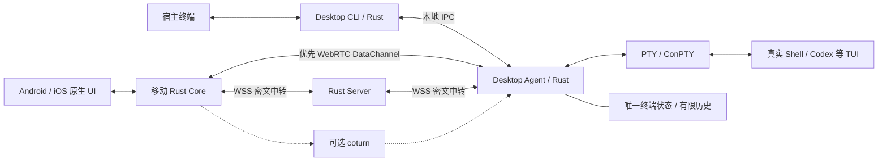

# AI Terminal 技术调研与架构建议

调研日期：2026-09-21。本文区分官方已确认事实与待验证设计。性能数字为验收预算，不是本轮跑出的基准。第一版不实现内置 AI，未来定义单列于 [AI-SPEC.md](AI-SPEC.md)。

## 1. 推荐架构

采用 **桌面唯一终端状态 + 桌面/手机显示副本 + Rust 轻量 Server**。桌面后台 Agent 持有 PTY、Shell、终端解析器和历史；所有 UI 显示该状态；Server 负责设备身份、信令和必要的密文转发。

这同时服务三个目标：本地输入不依赖网络；手机不用重复解释终端输出；Server 不运行用户 Shell、不解析屏幕、不做 AI 推理，降低资源需求。



状态模块、PTY 管理等可在同一个 Agent 中，不需要拆成微服务。Server 信令连接可以常驻，直连时终端数据不经过 Server。未来 AI 放在桌面，通过 Agent 的受控接口读屏与操作，首版不增加模型依赖。

## 2. 一致性与宿主体验的边界

用户选择了“优先强一致，接受明确的终端兼容范围”。因此采用受管理的内层终端，而不是简单复制宿主输出。

### 2.1 一致性的准确承诺

每个会话一个权威 `S(session_epoch, revision)`。桌面和手机处于同一 revision 时，字符单元/占位宽度、颜色语义、光标、活动屏幕、行列数及已同步历史相同。

允许副本滞后：手机断网显示已标识的旧画面，桌面继续运行。恢复时先取得正确状态与控制权，再允许远程输入。**不承诺跨网络物理时刻相同、不让桌面等待手机 ACK、不允许分区期间两端独立修改会话。** 这是一套单一权威、有序提交与可校验恢复的合同。

字体、抗锯齿、DPI 与 Emoji 图形不保证像素一致。手机遵守权威 cell width，不自行决定几列；宿主自身 Unicode 宽度行为仍需实测兼容。

### 2.2 为什么原始 ANSI 广播不够

不同解析器、初始模式、Unicode 宽度和屏幕尺寸会令同样 VT 字节生成不同状态。终端还存在反向查询：应用可以询问光标位置、终端能力和颜色；宿主与影子解析器同时回复，会产生冲突。[S16]

推荐路径：应用 VT → 桌面唯一解析 → 统一显示状态 → UI。宿主接收的是绘制状态所需的 ANSI，不是直接接收应用原始输出。应用的 DSR/DA 等由引擎唯一回答；外层能力探测回复单独消费，不注入子进程。

手机不运行另一套 ANSI 解析器，也不在恢复时靠“回放最近几 KB 输出”猜当前状态。

### 2.3 什么仍与普通 Terminal 一样

运行 `ai-terminal` 后创建/连接 Agent，在 PTY 中启动真实交互 Shell。工作目录、导出环境、Shell 配置和历史按明确启动策略继承。macOS/Linux 默认用户 Shell；Windows 使用用户配置的 PowerShell，优先可用的 PowerShell 7，Windows PowerShell 作为显式兼容选择。

语法、补全、管道、PSReadLine 均由真正 Shell 实现。独立程序无法自动继承父 Shell 内存中的全部临时函数和未导出变量，也不能无损接管已经运行的程序。`ai-terminal` 是新会话入口。

CLI detach 后后台 Agent 可继续持有会话；Shell exit 结束会话。后台运行于用户权限，Windows 不采用 Session 0 系统服务承载交互 Shell。机器睡眠/关机后无法继续执行。

宿主自己的 scrollback、文字选择和快捷键不一定与直接 Shell 完全相同。推荐产品管理统一历史视图，映射常用操作，并列明与宿主快捷键的冲突。

## 3. 技术选型

| 层 | 首选 | 判断依据与边界 |
| --- | --- | --- |
| Server | Rust + Tokio + Axum + rustls + SQLite | 单服务、无 JVM/Node 运行时依赖；低资源仍需实测 |
| PTY | portable-pty | WezTerm 的跨平台 PTY 抽象，支持子进程、读写和 resize [S1] |
| 终端引擎 | alacritty_terminal | 复用真实终端的 grid、damage、renderable content，不移植 GUI [S3] |
| 宿主 I/O | crossterm + 专用 cell 增量绘制 | raw mode、输入、resize、基础控制；不把它当完整模拟器 [S4] |
| 网络消息 | Protobuf / prost | 固定 schema、版本协商、二进制表示，避免高频 JSON cell 数据 |
| WebRTC | libdatachannel 的 C API/Rust 包装 | 官方列出五个平台，可关闭音视频；非全 Rust 但符合稳定优先 [S6] |
| 移动桥接 | UniFFI | Kotlin/Swift 支持及 Firefox 生产使用 [S10] |
| Android UI | Kotlin、Compose 页面、自定义 View/Canvas | 控件承载页面，终端使用批量文本绘制 |
| iOS UI | SwiftUI 页面、UIKit + CoreText/CALayer 终端视图 | 原生输入与绘制；GPU 优化由基准决定 |

`alacritty_terminal` 是引擎候选，不自带本项目需要的恢复/同步协议。适配层应导出自有 `RenderState`，不能直接把引擎内部 struct/serde 表示作为长期网络协议。Grid 可序列化也不等于完整解析器可恢复。

建议 workspace 边界：`protocol`、`session-model`、`session-sync`、`transport`、`device-security`、`terminal-engine`、`desktop-agent`、`desktop-cli`、`mobile-core`、`server`，加 `apps/android`、`apps/ios`、`deploy`。未来 `ai-agent` 单独加入，首版不放空壳执行器。

手机共享 Rust 的协议、状态副本、同步、加密和传输，不必链接桌面 PTY 或再运行终端解析器，避免无价值的平台依赖。

## 4. Desktop 如何避免卡顿和显示异常

### 4.1 本地与网络隔离

本地输入 → IPC → Agent 控制仲裁 → PTY。输出 → 引擎 → 本地显示。网络发送、压缩、手机 ACK 和未来模型请求均不得阻塞这条关键路径。

引擎必须处理每一个 PTY 字节，不能因限帧而跳过转义序列。可合并的是未显示/未发送的屏幕状态：高频进度条可以只显示最新状态，不能随意删原始 VT。

引擎发布有界、可共享的状态变更；本地绘制脏行/脏区，不每次清屏，不整屏构建巨大字符串，不持有状态锁等待网络。空闲不定时全屏刷新。低流量回显及时提交，高流量合并更新；不能强制本地等待 50 ms 网络 batch。

慢手机只保留已确认基线与待发最新状态，落后超过窗口则重取快照。网络拥塞不得使桌面输入等待；桌面自身 CPU 超载仍可能产生 PTY backpressure，Rust 不保证无限吞吐。

### 4.2 能力合同

首版验证 UTF-8、明确 Unicode 宽度策略、SGR/真彩色、光标/擦除、滚动区、主/备用屏、bracketed paste、常见鼠标协议、查询回复、明确协商的键盘能力。应用覆盖常用 Shell、PSReadLine、Vim、less/top 和至少一种 AI TUI。

首版不承诺 Kitty/iTerm 私有图像、完整 sixel、任意 OSC 透传或任意 Emoji 字体。超链接/剪贴板能力单列；OSC 52 不允许任意输出静默读取或改写设备剪贴板。

`TERM`/terminfo 必须描述内层已实现的能力，不能盲目继承宿主私有能力。调色板和默认前景/背景需统一解析并同步，防止同一默认颜色在两端不同。输入编码按应用当前 cursor/keypad/mouse/paste 模式生成，Ctrl-C 应进入前台程序。

原生宿主宽字符渲染、最右列自动换行、备用屏退出和异常恢复是专门测试点；状态 hash 正确不证明宿主实际画面必然正确。

### 4.3 Windows

通过 ConPTY 承载真实 PowerShell，不自行模拟 PowerShell。Microsoft 文档明确提醒同步通道、关闭时输出排空与死锁风险，推荐独立服务各通信通道。[S2] 不将阻塞管道读写全部放进 Tokio 主 worker。

覆盖 PSReadLine、多行输入、中文、Ctrl-C、resize、进程树退出、ConPTY teardown 和 raw mode 恢复。产品最低系统版本要按发布策略制定；库兼容旧 Windows 不等于产品自动支持它们。建议 Windows 11 优先验证。

## 5. 状态同步协议

### 5.1 消息与序号

建议消息骨架：

```text
Header    protocol_version, session_id, session_epoch, kind
Snapshot  revision, dimensions_epoch, rows, cols, active_screen,
          cells, cursor, palette, public_modes, history_range, state_hash
Delta     base_revision, revision, dimensions_epoch, typed_changes, state_hash
Input     controller_id, control_epoch, input_seq, action
InputAck  control_epoch, input_seq, accepted/written/rejected/unknown
Resize    control_epoch, dimensions_epoch, rows, cols
Resume    session_epoch, applied_revision, last_input_ack
```

首版的 typed changes 可先采用行片段替换、光标、模式和颜色变化；滚动热点明确后再加 Scroll 操作。此问题是单一权威状态同步，不需要多写入 CRDT。

小输入/小 delta 不压缩；大快照与历史分块按实测收益使用 zstd。接收端同时限制消息、组装快照和解压后大小，不能仅限制压缩包。

### 5.2 快照、增量与历史

客户端只接受 `base_revision == applied_revision` 的增量；旧重复版本忽略，缺基线触发恢复。快照在一致切点生成，先构建临时副本、校验后原子替换，再应用后续增量。旧路径迟到快照不能覆盖新状态。

状态 hash 根据规范化 schema 计算，不依赖机器字节序和 Rust struct 内存布局。版本号用于诊断，普通用户只需看到同步中/离线/可操作。

显示可以跳过被取代的中间帧；历史必须独立定义保留合同。以稳定行/块编号按需加载，配置容量和淘汰边界，明确告知历史截断。Mosh 官网也明确说明仅同步可见屏幕会影响完整 scrollback，因此不能照搬后宣称保留了所有日志。[S14]

Agent 崩溃后不保证恢复完整解析器和 Shell，屏幕快照不是操作系统进程检查点。

### 5.3 同一会话只能有一种尺寸

桌面连接时默认按桌面行列数；手机缩放/平移，不因旋转屏幕自动 resize。阅读辅助视图可换行，但不能冒充交互屏幕。显式交出尺寸控制权后手机可以修改共享尺寸，所有端同步。

resize、输出和模型变更由 Agent 排序。应用响应 SIGWINCH/ConPTY resize 的输出按实际到达处理，不能假设 resize 后立即产生完整新画面。dimensions epoch 防止旧尺寸更新覆盖新画面。

### 5.4 控制权与输入去重

多观察者、单控制者，本地可立即抢占。控制 token 带递增 epoch；未来 AI 与手机一样遵守它。旧连接或旧 AI 调用在失去控制权后不能输入。

输入有序可靠，跨路径仍使用同一逻辑序号。在同一存活 session/control epoch 内重复 Input 只能写一次。去重窗口有界；太旧或存在缺口的输入显式拒绝或恢复，不能默认为“没见过”而重放。

ACK 区分“已接收”和“已写 PTY”，均不代表命令执行成功。长粘贴分块保序，记录已写偏移，保持完整 bracketed-paste 边界；人工抢占/取消要处理正在进行的粘贴。

PTY 写入与数据库不能做原子事务。若写入后、ACK 前 Agent 崩溃，结果可能未知；新 epoch 禁止自动重放可能已经执行的操作。不能承诺跨进程崩溃 exactly-once。

## 6. WebRTC 与中转

### 6.1 库与通道

libdatachannel 官方列出 Linux/macOS/Windows/Android/iOS，支持 C API；可设置 `NO_MEDIA` 关闭音视频，需要时关闭自带 WebSocket，WSS 用 Rust 客户端实现。限制线程池并固定依赖/工具链，不能假设默认配置最低内存。[S6]

第一版把 control/input、screen、history 分逻辑通道，均采用可靠有序传输；不在不可靠通道上传输输入或有依赖的增量。是否增加可替换、自包含的非可靠屏幕消息，由后续弱网实测决定。

大快照建议起始按 8–16 KiB 分块，并服从实际最大消息限制。RFC 8831 指出无消息交错时大消息可能独占 SCTP，多个流共享同一拥塞窗口。[S5] 多开 DataChannel 不等于网络优先级完全隔离。

### 6.2 三条不同路径

| 路径 | 意义 |
| --- | --- |
| WebRTC 直连 | ICE/STUN 得到可用点对点路径，终端流量不经 Server |
| WebRTC 经 TURN | 仍是 DataChannel，但终端数据已经在中转，解决部分 NAT/拓扑问题 |
| WSS 应用中转 | 两端连接 TLS/443，Server 转发统一业务协议密文，独立于 UDP/ICE |

libjuice 官方以 UDP 为主；libdatachannel 对 TURN TCP/TLS 的支持依赖后端，不能只配置 `turns:` 就宣布可应对所有网络。[S7] 因此保留独立 WSS 兜底。WSS 同样不保证穿透任意认证代理/防火墙，需要具体网络矩阵验证。

### 6.3 监测什么，何时切换

终端不是视频。“丢帧”需拆成网络更新迟到与本地绘制错过刷新；手机 GPU/主线程卡顿不能靠换 Server 路径解决。

主要指标：应用 ping/ACK RTT、p95 尾延迟、输入 ACK 停顿、状态 ACK 进度、在途字节、队列驻留时间、ICE 状态。SDK bufferedAmount 不覆盖全部底层 transport buffer，必须配合应用层发送窗口。[S6]

建议起始阈值，均待实测调整：

- 约 2 秒未建立直连，启用 WSS，后台继续尝试直连。
- RTT p95 持续约 3 秒超过 250 ms、ACK 停顿约 1 秒或队列年龄持续超过 200 ms，触发备用路径测量。
- 中转至少改善约 30% 且绝对降低 50 ms 时再主动切；当前链路失效则选择可用路径。
- 回切要求约 10 秒稳定优势，冷却约 30 秒；移动后台暂停主动探测。

这些不是标准值。跨洲 RTT 高不等于故障，双方共享瓶颈时中转不一定更好。两条路径都慢时降低刷新率/历史带宽，避免振荡。

### 6.4 切换协议

新路径先认证并绑定同一逻辑会话，交换 Resume；按已应用 revision 补增量或快照。输入仍用原序号去重；新链路可用后收敛到单主路径。切换不创建新 Shell，不重置 revision，不让迟到旧数据回退画面。

限制交给可靠协议栈的在途数据。已进入可靠有序通道的积压，无法通过删除应用队列撤回；严重时用新传输/显示代次恢复最新快照。WSS 可把控制与批量显示/历史放独立连接，减少 TCP 排队干扰，但仍需总带宽调度。

## 7. 原生移动端

Rust Core 管理同步与显示副本，原生层负责字体、IME、键盘、触控选择、无障碍、系统通知、生命周期和安全存储。主逻辑共享不意味着把 OS 特有接口都搬入 Rust。

Compose/SwiftUI 只构建页面，不为每个 cell 建一个控件。终端采用批量绘制、脏行与字形缓存，历史按窗口加载。先实现原生文本视图，只有真实基准证明必要时再加 Metal 等 GPU 路径。

UniFFI 官方支持 Kotlin/Swift，并用于 Firefox。[S10] `RenderBatch` 一次传整批变化或紧凑字节块，避免逐 cell FFI。固定所有权、回调线程、取消和释放规则；先测内存复制，再考虑局部 C ABI 优化。

Android Rust `cdylib` 产出 `.so`，集成 AAR/jniLibs；首选 arm64，模拟器 x86_64，校验现代 Android 16 KiB page-size 要求。[S18] iOS `staticlib` 产出 `.a`，连同 bindings 组成 XCFramework，分别构建真机/模拟器 slice。所有 C/C++ 和加密依赖同样交叉编译。

iOS 普通 App 后台会挂起，延长执行时间有限；Android 部分前台服务有启动与时限约束。[S11–S12] 首版会话常驻在 Desktop Agent，手机后台可以断开，前台恢复快照；不承诺无限后台 WebRTC。未来任务完成可接 APNs/FCM，但推送不是可靠常在线机制，也不能替代重连查询。

## 8. Server 与低配部署

### 8.1 控制面尽量小

一个 Rust 服务，SQLite 保存设备、配对与撤销信息，在线路由保留在有界内存。数据库使用少量连接与阻塞工作隔离，不每个屏幕更新都写数据库。不引入默认 Redis、Kafka、PostgreSQL 或 SFU。

直连时 Server 仅有心跳/信令；中转时需承担上传加下发，多个观察者的出口近似线性增加。Rust 不能减少必要出口流量，也不能使无限连接占用常量内存。

每设备/会话/连接设定消息大小、在途字节、速率、数量上限。Server 无法解密并合并屏幕，需由端点控制发送额度；慢消费者超限时背压/断开，由端点恢复快照，不在中转端随机删密文消息。

### 8.2 认证加密

TLS 只保护到 Server 的连接。WSS TLS 在 Server 终止后若没有应用层 E2EE，Server 仍可见终端内容。因此统一应用层认证加密，首次配对用扫码/短认证码固定设备公钥，不能只信 Server 临时发来的公钥。

采用维护中的既有协议实现，例如 Noise 的适当模式；具体握手、认证、重放窗口、重密钥策略在实现评审中固定，不自研密码算法。跨路径绑定同一 session 身份，但每个加密记录的 nonce 必须按协议唯一；应用 input_seq 不能直接代替 nonce 管理。

观察与输入控制权限分离；Agent 与 Server 都校验授权。设备撤销通过短有效期凭据、控制租约与撤销通知实现；离线 Agent 不可能立即知道 Server 的撤销，需明确窗口，不能宣称瞬间撤销所有离线直连。

Server 可见连接关系/流量/元数据，默认不保存终端明文。日志不记录按键、密钥、TURN 密码、完整 SDP 或完整终端上下文。

### 8.3 Docker Compose

最小部署为一个 Server 容器、SQLite/配置卷；可直接 rustls 加载证书，并提供明确续期方式。已有反代可复用，可选 Caddy profile 提供自动 TLS，不强制所有低配机器增加代理进程。

可选 coturn profile 提供 STUN/TURN，配置公网地址、监听端口、有限 relay 端口范围、临时认证和配额，不能开放匿名 TURN。[S13] TURN 的内存/出口与应用服务分别测量。

发布 amd64/arm64 镜像；固定版本/摘要、非 root、只读根、必要可写卷、健康检查、日志轮转、资源限额、优雅退出。SQLite 使用一致性备份方法，不只拷贝在线主文件遗漏 WAL。

建议从 **1 vCPU / 512 MiB Linux** 验证小规模部署，256 MiB 仅作为精简配置实验目标。进程 RSS 不是整机内存；操作系统、Docker、socket buffer、代理与 TURN 都需另计。没有压测前不承诺最低机器规格或最大并发。

## 9. 替代方案比较

| 方案 | 价值 | 本项目判断 |
| --- | --- | --- |
| PTY 直通 + 手机影子解析 | 本地路径短，保留更多宿主特性 | 与已选择的强一致存在冲突，不作主方案 |
| tmux + SSH | Unix 成熟可用 | 不统一原生 Windows/ConPTY 与双移动平台，不能直接满足所有约束 |
| Mosh | 弱网状态同步经验 | 借鉴思想；预测显示、可见屏幕/历史语义不直接照搬 [S14] |
| WezTerm mux/termwiz | 已有 Rust mux 与 Surface/Change | 可作原型参照；完整产品不直接嵌入，termwiz 也提示 API 变化 [S15] |
| libghostty-vt | 丰富 VT、C API、已有 render/snapshot | 认真候选；当前 API 仍不稳定，先用 Alacritty，遇到具体兼容阻塞再评估替换 [S9] |
| xterm.js + WebView | 终端生态成熟、开发快 | 不符合用户原生 UI/共享 Rust 主逻辑方向，非默认方案 |
| libdatachannel | 五平台、C API、可关闭媒体 | 首选验证，代价为 C/C++ 构建及 MPL-2.0 义务 [S6] |
| webrtc-rs | Rust 完整 WebRTC 方向 | 当前官方 0.21 路线有重要重构与流控修复，不因纯 Rust 就推断更稳 [S8] |
| str0m | Sans-I/O、可控调度 | 官方提示 P2P 测试较少，TURN/候选收集需外部集成，增加本项目工作 [S8] |
| Google libwebrtc | 广泛部署、完整功能 | 构建与包体较重，只有当前候选无法通过网络/移动验证时再考虑 |
| 视频屏幕流 | 视觉直观 | 文本选择、清晰度、带宽、输入语义不合适，不作主协议 |

## 10. 验证门槛

正确性先于微优化。以下均是建议目标，需要固定硬件、系统、依赖版本与语料再测：

| 指标 | 负载/测量 | 目标 |
| --- | --- | --- |
| 本地附加延迟 | 同宿主直接 Shell 对比 ai-terminal；可控回显程序先排除 Shell 自身差异 | 输入至可绘制状态额外 p95 ≤ 5 ms、p99 ≤ 15 ms；实际显示刷新另测 |
| 网络隔离 | 手机 1 Mbit/s、100 ms RTT、丢包，桌面持续输出 | 本地无网络等待、队列有界、手机最终恢复 |
| 移动帧工作 | 120×40 cell、每秒 30 次更新、滚动与宽字符 | 主线程工作 p95 ≤ 16.7 ms，实际帧率/耗电另报告 |
| 常规带宽 | 120×40、10 键/秒、普通回显，60 秒，排除初始快照/历史 | 应用 payload 平均 ≤ 10 KiB/s 作为预算，线速/重传单独报告 |
| 极端输出 | 大日志、全屏持续变化 | 不要求逐帧传输，不丢权威 VT 解析，内存有界 |
| Server 空闲 | Release、TLS/SQLite、0 活跃会话 | 进程 RSS ≤ 32 MiB |
| Server 中转 | 20 对连接、每对单向 64 KiB/s、30 分钟 | RSS ≤ 96 MiB、无持续增长，CPU/容器 working set/内核 socket 内存另报 |
| 恢复画面 | 120×40、快照 ≤ 128 KiB、RTT ≤ 100 ms、有效吞吐 ≥ 5 Mbit/s | 连接建立后约 1 秒恢复；不含唤醒与 ICE 建连时间 |

关键自动化：

1. VT 任意分块、UTF-8 边界、宽/组合字符、备用屏、滚动区、查询、resize 的状态断言。
2. 快照/增量在重复、乱序、丢消息、断线、混合路径情况下的 revision/hash 一致，错误 base 不应用。
3. 输入去重、过期控制 token、部分粘贴、控制权抢占、超限拒绝、已写但未 ACK 的不确定结果。
4. UDP 阻断、延迟、抖动、带宽受限下的 WSS 与 WebRTC 恢复；无重复操作、无会话重建。
5. Windows ConPTY 关闭与进程树，Unix 信号/控制终端；掉网不影响本地会话。

宿主矩阵至少覆盖 Terminal.app/iTerm2、现代 Linux 终端、Windows Terminal + PowerShell；真实应用覆盖 bash/zsh/fish、PSReadLine、Vim、less/top、一个交互式 AI CLI。真机验收关注字体/Emoji、IME、物理键盘、选择、无障碍、后台和网络切换。

本轮没有运行构建、性能或真机测试。实施期先检查可用设备，按计划决定真机验证；不得将研究建议冒充已测试结论。

## 11. 交付顺序

P0 验证最难部分：宿主嵌套绘制、PowerShell 与终端查询不异常，手机最小视图可消费相同状态，原生依赖可构建。失败先处理语义/依赖，不能靠完善页面掩盖基础风险。

随后为：本地会话 → WSS 安全远程基线 → WebRTC 优先与切换 → 双平台原生体验及低配发布。第一版包含 AI 定义文档，但不实现 AI。

不以首版为理由省略配对、输入去重或状态恢复，它们决定是否会远程误操作。人力与排期未知，暂不给伪精确日期；主要工作量来自宿主兼容、原生双平台和可靠同步。

## 12. 官方来源与核实范围

资料于 2026-09-21 检索/读取；README 自述只用于确认接口和支持范围，不视为独立性能证明。实现应锁定经过原型验证的发布版，以下 commit 用于保留调研依据。

- **S1** [portable-pty API](https://docs.rs/portable-pty/latest/portable_pty/)；[源码](https://github.com/wezterm/wezterm/blob/b09b56c29c1e367e598b60ca266e2cc9038751e0/pty/src/lib.rs)：已核实 PTY、子进程、resize、读写接口。
- **S2** [Microsoft 创建 Pseudoconsole 会话](https://learn.microsoft.com/en-us/windows/console/creating-a-pseudoconsole-session)：已读取同步通道、独立线程和关闭死锁说明。
- **S3** [Alacritty Term 源码](https://github.com/alacritty/alacritty/blob/d692748d3f61253ebe9f5094320120d22f6a046f/alacritty_terminal/src/term/mod.rs)：已核实 grid、damage、renderable_content、resize；Cargo manifest 许可 Apache-2.0。
- **S4** [crossterm 官方仓库](https://github.com/crossterm-rs/crossterm)：已读取 raw mode、事件、resize、备用屏和跨平台说明。
- **S5** [RFC 8831](https://www.rfc-editor.org/rfc/rfc8831.html)：已读取可靠性/有序性、共享拥塞窗口、消息交错和 16 KB 建议。
- **S6** [libdatachannel README](https://github.com/paullouisageneau/libdatachannel/blob/eb26969fdb932218d0742642aa38620715395e54/README.md)、[C API](https://github.com/paullouisageneau/libdatachannel/blob/eb26969fdb932218d0742642aa38620715395e54/DOC.md)、[构建](https://github.com/paullouisageneau/libdatachannel/blob/eb26969fdb932218d0742642aa38620715395e54/BUILDING.md)：平台、MPL-2.0、NO_MEDIA、缓冲计数限制、线程配置。
- **S7** [libjuice README](https://github.com/paullouisageneau/libjuice)、[libdatachannel reference](https://libdatachannel.org/pages/reference.html)：已核实 UDP 与 ICE/TURN 后端限制。
- **S8** [webrtc-rs README](https://github.com/webrtc-rs/webrtc/blob/573cfbe4d2e878ea47e44a4f8efd31bfba960040/README.md)、[str0m README](https://github.com/algesten/str0m/blob/247b96905bc0b66925bdf52b167fef8a88c364a7/README.md)：重构、可靠通道背压，以及 P2P/TURN 集成边界。
- **S9** [Ghostty README](https://github.com/ghostty-org/ghostty/blob/3c47ca159368eb4a860ffe5333abdf4a85b2767b/README.md)、[libghostty-vt 头文件](https://github.com/ghostty-org/ghostty/blob/3c47ca159368eb4a860ffe5333abdf4a85b2767b/include/ghostty/vt.h)：可用，API 尚不稳定，已有 render/snapshot 模块。
- **S10** [UniFFI README](https://github.com/mozilla/uniffi-rs/blob/aea52cbe269183afba665372c991420253cbe56e/README.md)、[文档](https://mozilla.github.io/uniffi-rs/latest/)：Kotlin/Swift、Firefox 使用、升级稳定性边界。
- **S11** [Apple 延长后台执行时间](https://developer.apple.com/documentation/uikit/extending-your-app-s-background-execution-time)：通过该文档官方 JSON 读取，确认挂起与有限额外时间；论坛页面遇浏览器验证，未用论坛正文作证据。
- **S12** [Android 前台服务超时](https://developer.android.com/develop/background-work/services/fgs/timeout)：已读取相关系统条件下 dataSync/mediaProcessing 的 24 小时内 6 小时限制，不泛化到所有服务类型。
- **S13** [coturn](https://github.com/coturn/coturn)：已读取 README 的 Docker 端口、TURN REST 临时认证与可选存储。
- **S14** [Mosh 设计与 FAQ](https://mosh.org/)：已读取状态同步、预测及可见屏幕/scrollback 边界。
- **S15** [WezTerm multiplexing](https://wezterm.org/multiplexing.html)、[termwiz README](https://github.com/wezterm/wezterm/blob/b09b56c29c1e367e598b60ca266e2cc9038751e0/termwiz/README.md)：已读取后者的 Surface/Change、终端抽象及 API 变化说明。
- **S16** [XTerm 控制序列](https://invisible-island.net/xterm/ctlseqs/ctlseqs.html)：DSR/光标查询与 OSC 的官方参考，实施期作为能力测试依据。
- **S17** [VS Code Shell Integration](https://code.visualstudio.com/docs/terminal/shell-integration)、[iTerm2 Shell Integration](https://iterm2.com/documentation-shell-integration.html)：已读取 VS Code 对 OSC 633/133 的命令边界、可选退出码、命令 nonce 的说明；具体 hooks 仍需逐 Shell 验证。
- **S18** [Android 支持 16 KB page sizes](https://developer.android.com/guide/practices/page-sizes)：已读取原生库重编译、ELF/包对齐及工具链说明，不仅校验 Rust 主库，还需校验其第三方原生依赖。

本轮完成空目录检查、官方资料核实与方案设计；未安装候选依赖、初始化产品仓库或改变系统配置。
